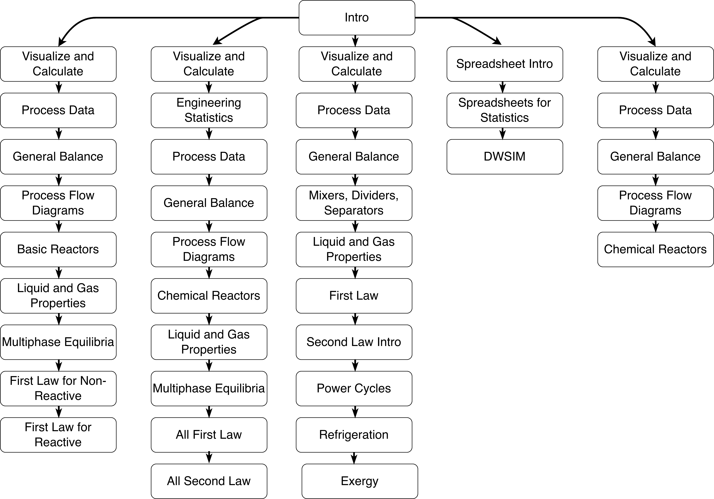



# Introduction

DOFPro CTP is a guided collection of videos, visuals, and reference pages covering the core topics of **chemical and thermal process engineering**. The site is organized so that you can either move through the material topic by topic or follow one of several curated pathways depending on your background and goals.

The introductory video below gives a broad overview of the subjects covered in the project, from basic process variables and engineering calculations all the way through balances, thermodynamics, reactors, phase equilibria, and process cycles.

## From Mole to Megawatt: The Full Journey Through Chemical and Thermal Engineering

This video introduces the scope of the DOFPro CTP project and gives a high-level tour of the topics covered throughout the site.

<iframe width="560" height="315" src="https://www.youtube.com/embed/8FEmNkiU1Jk?si=cZl4f3nPPIqWIx1N" title="YouTube video player" frameborder="0" allowfullscreen></iframe>

# List of Topics

The videos and reference pages on this site are organized around the major tools and ideas used in chemical and thermal engineering.

## Introduction

The introduction provides a broad overview of the discipline and shows how the major topics connect to one another.

## Basic Engineering Calculations

The first group of videos covers the calculation tools that engineers use repeatedly in later topics.

### Transformation and presentation of process data

How to visualize data, recognize trends, and choose useful coordinate systems.

### Interpolation, both linear and nonlinear

How to estimate values from tabulated data when an exact tabulated value is not available.

### Spreadsheets for calculations, statistics, and regression

How to use spreadsheets as practical engineering tools for calculations, fitting, and numerical work.

### Roots of linear and nonlinear equations

How to solve engineering equations that cannot be rearranged directly into closed form.

### Statistics and Measurements

How to describe uncertainty, summarize data, and extract useful information from experimental results.

### Unit, Temperature, and Equation Conversions

How to work with engineering units, temperature scales, dimensional equations, and equations with units.

### Types of process data

How engineers define and use common process variables such as pressure, temperature, flow rate, density, moles, and composition.

## Balances

The balances section develops the general balance equation and applies it to **material**, **energy**, **entropy**, and **exergy**.

## Phase Equilibria

This section introduces phase diagrams, dew and bubble calculations, flash calculations, and staged separations.

## Reactors

This section covers material balances around reacting systems, including conversion-based, kinetic, and equilibrium reactor models.

## Appendices

The appendices collect supporting material, including explanations of titles, pathways, and other reference information.

# Pathways Through the Videos

You can move through the videos in several different ways. The pathway pages below collect videos into useful sequences for different audiences and purposes.

|[Intro to Chemical Engineering](../../pathway2.qmd)|[The Full Video Set](../../pathway1.qmd)|[Mechanical Engineering Thermodynamics](../../pathway3.qmd)|[Spreadsheets](../../pathway4.qmd)|[Chemical Reactor Engineering](../../pathway5.qmd)|
|:-----:|:-----:|:-----:|:-----:|:-----:|

The diagram below shows these pathways visually.

